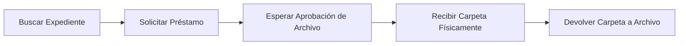
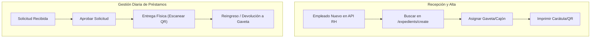

# 📖 Manual de Operaciones: Sistema de Control de Archivo Físico de Personal

**Versión del Sistema:** 2.0 (Laravel 13 & Livewire 4)  
**Entorno de Acceso:** [http://localhost:8194](http://localhost:8194)  

---

## 📑 Tabla de Contenido
1. [Introducción y Objetivos](#1-introducción-y-objetivos)
2. [Roles y Niveles de Acceso](#2-roles-y-niveles-de-acceso)
3. [PARTE I: Manual para Usuarios Solicitantes / Consulta](#parte-i-manual-para-usuarios-solicitantes--consulta)
   - [1. Inicio de Sesión](#1-inicio-de-sesión)
   - [2. Búsqueda y Consulta de Expedientes](#2-búsqueda-y-consulta-de-expedientes)
   - [3. Solicitud Individual de Préstamo](#3-solicitud-individual-de-préstamo)
   - [4. Solicitud Masiva con Escáner](#4-solicitud-masiva-con-escáner)
   - [5. Seguimiento de Solicitudes y Préstamos Activos](#5-seguimiento-de-solicitudes-y-préstamos-activos)
4. [PARTE II: Manual para Administradores de Archivo y RH](#parte-ii-manual-para-administradores-de-archivo-y-rh)
   - [1. Dashboard y Monitoreo General](#1-dashboard-y-monitoreo-general)
   - [2. Alta y Registro de Nuevos Expedientes](#2-alta-y-registro-de-nuevos-expedientes)
   - [3. Gestión del Ciclo de Préstamos](#3-gestión-del-ciclo-de-préstamos)
   - [4. Gestión de Ubicaciones Físicas](#4-gestión-de-ubicaciones-físicas)
   - [5. Auditoría de Estanterías y Gavetas (Inventario Físico)](#5-auditoría-de-estanterías-y-gavetas-inventario-físico)
   - [6. Impresión de Carátulas, Etiquetas y Reportes](#6-impresión-de-carátulas-etiquetas-y-reportes)
   - [7. Administración de Usuarios y Permisos](#7-administración-de-usuarios-y-permisos)
5. [Buenas Prácticas y Preguntas Frecuentes (FAQ)](#5-buenas-prácticas-y-preguntas-frecuentes-faq)

---

## 1. Introducción y Objetivos

El **Sistema de Control de Archivo Físico** tiene como objetivo principal garantizar la trazabilidad total, seguridad y rápida localización de los expedientes laborales físicos del personal. 

### Principios Fundamentales:
* **Cero Expedientes Extraviados:** Todo movimiento físico debe estar respaldado por un registro en el sistema.
* **Trazabilidad Inmutable:** Cada cambio de estatus, préstamo, entrega o reubicación queda grabado en la bitácora con fecha, hora y usuario responsable.
* **Integración en Tiempo Real con RH:** Búsqueda directa con el sistema de nómina/empleados para la apertura ágil de expedientes.

---

## 2. Roles y Niveles de Acceso

| Perfil | Rol en Sistema | Funciones Principales |
| :--- | :--- | :--- |
| **Usuario Consulta / Solicitante** | `user` | Consultar catálogo de expedientes, solicitar préstamos individuales y masivos, monitorear el estado de sus solicitudes. |
| **Administrador de Archivo** | `admin` | Crear y editar expedientes, aprobar/rechazar solicitudes, entregar físicamente expedientes, registrar devoluciones, gestionar ubicaciones físicas y realizar auditorías de estantes. |
| **Superusuario** | `superuser` | Todas las funciones de Administrador + gestión de usuarios, roles, configuraciones del sistema y logs globales. |

---

# PARTE I: Manual para Usuarios Solicitantes / Consulta

### 1. Inicio de Sesión
1. Abra su navegador web e ingrese a [http://localhost:8194/login](http://localhost:8194/login).
2. Introduzca su **Correo electrónico** institucional y **Contraseña**.
3. Haga clic en **"Iniciar Sesión"**.

---

### 2. Búsqueda y Consulta de Expedientes
1. Diríjase al menú lateral **"Expedientes"**.
2. Utilice la barra de búsqueda para filtrar por:
   - **RFC** del empleado (ej. `GOMA85...`).
   - **Nombre completo** o apellidos.
   - **Código de expediente** (ej. `EXP-GOMA85-01`).
   - **Estatus actual** (Disponible, En Préstamo, En Revisión, etc.).
3. Haga clic en el ícono de **ojo / ver detalle** para abrir la ficha técnica y verificar si la carpeta se encuentra disponible o prestada a otro colaborador.

---

### 3. Solicitud Individual de Préstamo
Cuando requiera consultar físicamente la carpeta de un trabajador:
1. En la lista de **Expedientes**, ubique el expediente deseado (debe mostrar el estatus `Disponible`).
2. Haga clic en el botón **"Solicitar Préstamo"** (ícono de mano o flecha).
3. En el formulario emergente:
   - Indique el **Motivo / Observaciones** de la consulta (ej. *Auditoría IMSS, Consulta de contrato, Actualización de documentos*).
4. Haga clic en **"Enviar Solicitud"**.
5. Recibirá una notificación en pantalla y la solicitud quedará en estado `Pendiente de Aprobación`.

---

### 4. Solicitud Masiva con Escáner
Si requiere solicitar varios expedientes al mismo tiempo (ej. para un proceso de auditoría):
1. Vaya al menú **Préstamos** ➔ **"Solicitud Masiva"** ([`/loans/bulk`](http://localhost:8194/loans/bulk)).
2. Utilice una pistola lectora de código de barras / QR o escriba manualmente los códigos de los expedientes.
3. El sistema irá validando en tiempo real que cada expediente esté disponible y lo agregará a la lista temporal.
4. Ingrese las observaciones generales y presione **"Procesar Solicitudes"**.

---

### 5. Seguimiento de Solicitudes y Préstamos Activos
1. Ingrese a **"Mis Préstamos"** en el módulo de Préstamos.
2. Podrá revisar los estados de sus peticiones:
   - 🟡 **Pendiente:** El personal de archivo aún no revisa su petición.
   - 🟢 **Aprobado:** Su solicitud fue autorizada; puede pasar a ventanilla de archivo a recoger la carpeta.
   - 🔵 **En Préstamo:** Tiene la carpeta física en su poder.
   - 🔴 **Vencido:** Se superó la fecha límite pactada de devolución; debe reingresar la carpeta de inmediato.

> [!IMPORTANT]
> El usuario solicitante es legalmente responsable del resguardo y confidencialidad del expediente físico mientras se encuentre en estado **En Préstamo**.

---

# PARTE II: Manual para Administradores de Archivo y RH

---

### 1. Dashboard y Monitoreo General
El panel principal ([`/dashboard`](http://localhost:8194/dashboard)) ofrece visibilidad operativa inmediata:
* **Contadores en vivo:** Total de expedientes, disponibles en gaveta, actualmente prestados y préstamos vencidos.
* **Alertas de Préstamos Vencidos:** Listado de usuarios con expedientes pendientes de devolución fuera de plazo.
* **Actividad Reciente:** Bitácora en tiempo real de quién solicitó, entregó o reubicó expedientes.

---

### 2. Alta y Registro de Nuevos Expedientes
Para incorporar un nuevo expediente físico al archivo:
1. Diríjase a **Expedientes** ➔ **"Nuevo Expediente"** ([`/expedients/create`](http://localhost:8194/expedients/create)).
2. En la sección **"Buscar Empleado"**, escriba el RFC o nombre. El sistema consultará automáticamente el API corporativo de Empleados.
3. Al seleccionar al trabajador, el sistema precargará sus datos oficiales.
4. Complete los datos físicos:
   - **Tomo / Volumen:** Por defecto `1` (si ya existe un tomo previo, el sistema incrementa automáticamente a `2`, `3`, etc.).
   - **Ubicación Inicial:** Seleccione la gaveta y cajón donde se colocará físicamente.
   - **Tipo de Expediente:** Ordinario, Confidencial, Directivo, etc.
   - **Notas iniciales:** Estado físico de los documentos, número de fojas, etc.
5. Haga clic en **"Guardar y Crear Expediente"**.

---

### 3. Gestión del Ciclo de Préstamos

El Administrador es el único facultado para cambiar los estados de préstamo:

#### **A) Aprobar / Rechazar Solicitudes**
1. En **Préstamos** ([`/loans`](http://localhost:8194/loans)), ubique las solicitudes en estatus `Pendiente`.
2. Verifique la justificación y haga clic en **"Aprobar"** o **"Rechazar"** (indicando motivo).

#### **B) Entrega Física de la Carpeta (Despacho)**
1. Cuando el solicitante acuda a ventanilla:
2. Localice la solicitud aprobada y haga clic en **"Entregar"**.
3. Defina la **Fecha Límite de Devolución** (ej. 3 días, 7 días).
4. El expediente pasará formalmente a estatus `En Préstamo` y se registrará la hora exacta de entrega.

#### **C) Recepción y Reingreso al Archivo (Devolución)**
1. Al recibir la carpeta física de regreso:
2. Revise que la documentación esté completa.
3. Haga clic en **"Procesar Devolución"**.
4. Puede ingresar notas de devolución (ej. *"Expediente entregado en buen estado con 45 fojas"*).
5. El sistema regresará el expediente al estatus `Disponible` en su gaveta correspondiente.

---

### 4. Gestión de Ubicaciones Físicas
Para mantener el archivo ordenado:
1. Ingrese a **Ubicaciones** ([`/locations`](http://localhost:8194/locations)).
2. Haga clic en **"Nueva Ubicación"**.
3. Ingrese la jerarquía física:
   - **Sucursal:** Sede o edificio.
   - **Nombre:** Sala o zona (ej. *Archivo Activo RH*).
   - **Gaveta:** Número o código de mueble (ej. *Archivero G-01*).
   - **Cajón:** Número de cajón o nivel (ej. *Cajón 2*).
   - **Rango Alfabético:** Ej. *GOM - MOR*.
4. Guarde la ubicación. Ahora estará disponible para asociar expedientes.

---

### 5. Auditoría de Estanterías y Gavetas (Inventario Físico)
Herramienta diseñada para auditorías masivas sin margen de error humano:
1. Abra **Expedientes** ➔ **"Auditoría de Estante"** ([`/expedients/audit`](http://localhost:8194/expedients/audit)).
2. Seleccione el mueble/cajón específico que va a auditar físicamente.
3. Tome la pistola de código de barras y escanee una a una las carpetas que están dentro del cajón.
4. El sistema comparará al instante lo escaneado contra la base de datos y mostrará:
   - 🟢 **Correctos:** Expedientes que pertenecen a ese cajón y están presentes.
   - 🔴 **Faltantes / Extraviados:** Expedientes registrados en ese cajón que no fueron escaneados.
   - ⚠️ **Fuera de Lugar:** Expedientes escaneados que deberían estar en otro cajón o en préstamo.

---

### 6. Impresión de Carátulas, Etiquetas y Reportes
* **Carátula con Código QR:** Desde la ficha del expediente ([`/expedients/{id}`](http://localhost:8194/expedients)), haga clic en **"Imprimir Carátula"** para generar la portada oficial con código de barras y QR listo para pegar en la ceja del folder.
* **Inventario para Impresión:** En **Ubicaciones** ➔ **"Imprimir Inventario"** ([`/reports/inventory`](http://localhost:8194/reports/inventory)) puede exportar el listado completo para revisiones físicas en papel o auditorías externas.

---

### 7. Administración de Usuarios y Permisos (Solo Superusuarios)
1. Ingrese a **Usuarios** ([`/users`](http://localhost:8194/users)).
2. Para crear un nuevo usuario:
   - Clic en **"Nuevo Usuario"**.
   - Capture nombre, correo electrónico y contraseña inicial.
   - Asigne el rol: `Superusuario`, `Administrador de Archivo` o `Usuario Consulta`.
3. Para restablecer acceso o suspender a un usuario:
   - Utilice los botones de **Editar** o **Desactivar** en la tabla.

---

## 5. Buenas Prácticas y Preguntas Frecuentes (FAQ)

### 💡 Reglas de Oro del Archivo:
1. **Ninguna carpeta sale sin registro:** Jamás entregue un expediente físico sin haber presionado **"Entregar"** en el sistema.
2. **Reingreso inmediato:** En cuanto el usuario devuelva la carpeta, regístrela como devuelta y colóquela de inmediato en su gaveta correspondiente.
3. **Auditorías quincenales/mensuales:** Realice auditorías con escáner cajón por cajón para detectar a tiempo carpetas mal archivadas.

### ❓ Preguntas Frecuentes:
* **¿Qué hago si un empleado no aparece en el sistema de Archivo?**  
  Vaya a *Nuevo Expediente* y búscelo por su RFC. El sistema se comunicará en vivo con el sistema central de personal y lo importará automáticamente.
* **¿Qué sucede si un empleado tiene más de una carpeta física porque ya no cabe la documentación?**  
  Al crear el expediente para ese mismo trabajador, el sistema creará el **Tomo 2** (`VOL-2`), permitiendo ubicar cada tomo incluso en gavetas diferentes si fuera necesario.
* **¿Cómo recupero la contraseña de un usuario?**  
  Un Administrador o Superusuario puede cambiar la contraseña directamente desde el módulo de *Usuarios*.
