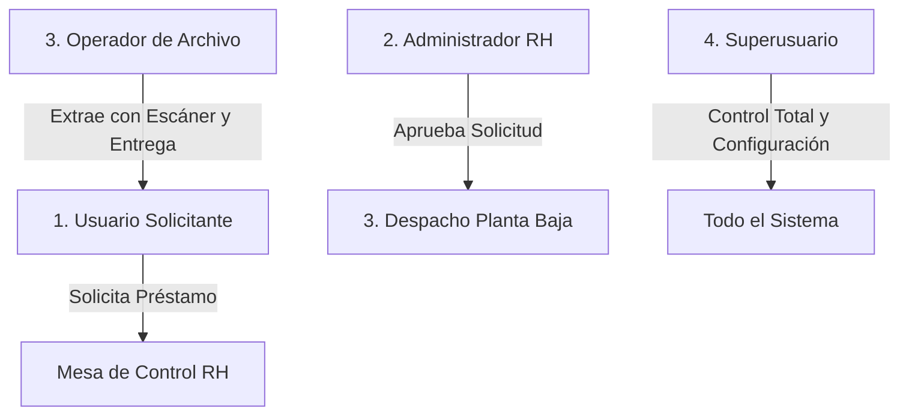
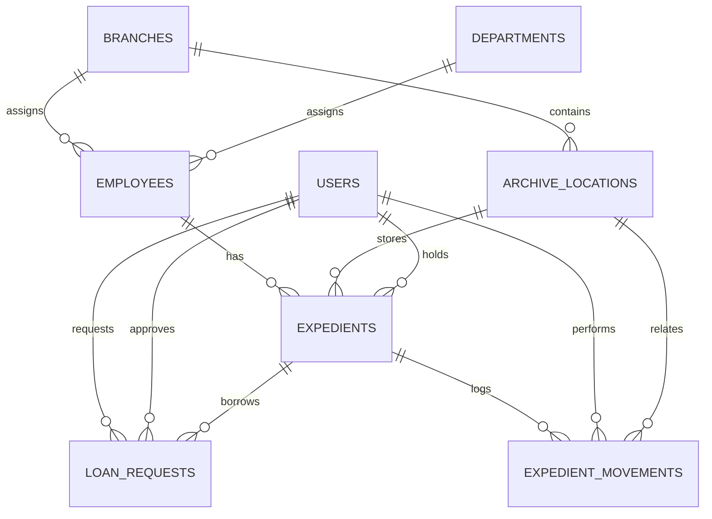

# Archivo — Documento Maestro del Proyecto Laravel

---

# Descripción General

## Nombre del Proyecto

**Archivo** (Sistema Integral de Gestión y Trazabilidad Documental de Archivo Físico)

## Institución y Entorno

- **Institución:** ISSSTE Delegación Baja California (Subdelegación de Administración / Departamento de Recursos Humanos).
- **Entorno:** Sistema web intranet con soporte de operación offline para lectores y escáneres ópticos.

## Framework y Stack Tecnológico

- **Backend:** Laravel 13 / PHP 8.4
- **Frontend Reactivo:** Livewire 4.2 + Alpine.js
- **Diseño y Componentes UI:** MaryUI 2.8 + DaisyUI + Tailwind CSS v4
- **Base de Datos:** MySQL / PostgreSQL
- **Códigos de Barras:** `picqer/php-barcode-generator` (Code128 nativo para etiquetas térmicas)
- **Códigos QR:** `simplesoftwareio/simple-qrcode`
- **Escáner Óptico Autónomo:** `html5-qrcode` empaquetado 100% en local (`/vendor/html5-qrcode/html5-qrcode.min.js`), sin dependencias externas de CDN
- **Control de Acceso y Roles:** `spatie/laravel-permission` v7.3
- **Auditoría e Historial:** `spatie/laravel-activitylog` v5.0 + Bitácora relacional `expedient_movements`
- **Contenedores:** Docker (PHP-FPM, Nginx, PostgreSQL/MySQL con permisos POSIX sincronizados UID 1000)

## Objetivo

Crear un sistema de control, custodia y rastreo de expedientes físicos del personal.

El sistema permite conocer en todo momento:

- Dónde está el expediente físicamente (Gaveta, Cajón y Sede).
- Quién lo tiene en posesión o custodia física (Usuario solicitante o responsable).
- Cuándo se solicitó, cuándo se aprobó y cuándo salió de archivo.
- En qué estado físico se entregó (inspección de carátula y número de fojas).
- Cuándo regresó y las observaciones de recepción.
- Historial permanente e inalterable de todos los movimientos.
- Detección de expedientes faltantes o mal ubicados mediante auditorías con código de barras.

---

# Problema Actual

Históricamente los expedientes físicos eran controlados manualmente en libretas o papel.

Esto generaba:

- Riesgo de pérdida o extravío de expedientes laborales sensibles.
- Falta de trazabilidad y desconocimiento del servidor público responsable de la carpeta.
- Tiempos muertos de búsqueda manual recorriendo archiveros.
- Dificultad para saber si una carpeta está prestada o traspapelada.
- Desgaste físico de carpetas por reacomodo manual constante.
- Dependencia absoluta de la memoria del personal operativo.

---

# Concepto del Sistema

El sistema funciona bajo un modelo integral de **Custodia y Préstamo Controlado en Dos Etapas** (análogo a un centro de distribución / biblioteca de alta seguridad):

- El expediente es un **activo físico con identidad digital única** (código de barras y QR).
- Siempre tiene un **estado**, una **ubicación física asignada** y un **responsable de custodia**.
- Toda transferencia física de posesión requiere **aprobación administrativa**, **inspección documental** y **confirmación de seguridad**.
- Registro histórico permanente de movimientos, cambios de ubicación y préstamos.

---

# Alcance del Sistema

## Módulos Implementados

1. **Gestión de Plantilla de Empleados:** Directorio del personal sincronizado mediante API externa delegacional.
2. **Control Central de Expedientes:** Búsqueda avanzada por RFC, código de barras, nombre o puesto; detalle histórico y estados.
3. **Alta Continua de Expedientes (Censo Masivo):** Módulo optimizado para digitalizar gavetas y cajones cerrados con impresión inmediata de etiquetas térmicas.
4. **Circuito de Préstamos en Dos Etapas:**
   - *Mesa de Control (RH):* Aprobación/Rechazo de solicitudes.
   - *Despacho (Planta Baja):* Lista de surtido (Picking List), extracción por escáner, notas de entrega (`delivery_notes`) y recepción física.
5. **Carga Masiva de Préstamos:** Préstamo simultáneo de múltiples expedientes en lote mediante escaneo continuo.
6. **Bandeja Personal:** Consulta y seguimiento de préstamos activos para usuarios solicitantes.
7. **Escáner Inteligente:** Reubicación en caliente de expedientes físicos mediante lectura de código de barras/QR.
8. **Auditoría de Control Físico:** Validación física de gavetas y cajones con pistola óptica para identificar expedientes faltantes o mal ubicados.
9. **Impresión de Etiquetas:** Formato optimizado para etiquetadoras térmicas con código Code128 y QR.
10. **Catálogo de Ubicaciones (Archiveros):** Administración de Sedes, Gavetas, Cajones y Rangos Alfabéticos/Dinámicos.
11. **Seguridad Crítica (Sudo):** Reautenticación por contraseña para operaciones críticas de entrega y devolución física.
12. **Reportes e Inventario:** Estadísticas en vivo y exportación a CSV con ordenamiento relacional.

## Exclusiones Actuales (Proyectado a Futuro)

- Digitalización documental completa (escaneo masivo de hojas a PDF / OCR).
- Firma electrónica avanzada (FIEL/e.firma).

---

# Modelo Real del Negocio

## Empleado

Cada empleado representa a un servidor público activo o inactivo en la plantilla delegacional. Se identifica unívocamente por su **RFC**.

## Expediente Físico

Cada expediente representa una carpeta física en las gavetas de archivo.

- Cuando una carpeta se satura de fojas, se genera un **Volumen Adicional** para el mismo empleado:
  - Volumen 1: `EXP-00123-V1`
  - Volumen 2: `EXP-00123-V2`
  - Volumen 3: `EXP-00123-V3`
- Un expediente tiene un ciclo de vida propio, ubicación física independiente y folio de barras único.

---

# Roles y Permisos del Sistema

El sistema implementa 4 roles institucionales con separación de funciones:



## 1. Superusuario (`superuser`)
- Acceso irrestricto a todas las funciones del sistema.
- Administración de usuarios, asignación de roles y permisos.
- Gestión de sedes delegacionales y configuraciones críticas.

## 2. Administrador de Recursos Humanos (`admin`)
- Autorización y rechazo de solicitudes de préstamo en la **Mesa de Control**.
- Alta de expedientes (individual y mediante el módulo de **Alta Continua**).
- Edición y reubicación de expedientes físicos.
- Administración del catálogo de archiveros y gavetas.
- Sincronización de plantilla de empleados desde API externa.
- Acceso a reportes de inventario y exportación de datos.

## 3. Operador de Archivo / Planta Baja (`operator`)
- Gestión de la consola de **Despacho** (`/loans/dispatch`).
- Consulta y ejecución de la **Picking List** (lista de surtido y extracción).
- Extracción física asistida por escaneo de código de barras.
- Registro de notas de entrega física (número de fojas y estado de carátula).
- Recepción de carpetas devueltas y re-archivado en cajón.
- Operación del **Escáner Inteligente** para reubicaciones dinámicas.
- Ejecución de la **Auditoría de Control Físico** de archiveros.

## 4. Usuario Solicitante (`user`)
- Búsqueda y consulta de disponibilidad de expedientes físicos.
- Generación de solicitudes individuales de préstamo.
- Consulta de su **Bandeja Personal** (expedientes en su posesión, fechas límite y vencimientos).
- Cancelación de sus propias solicitudes pendientes antes de aprobación.

---

# Flujos Oficiales del Sistema

## 1. Circuito Operativo de Préstamo (En 2 Etapas)

```
[Usuario] Solicita expediente en línea
   │
   ▼
[Mesa de Control - RH] Administrador revisa y APRUEBA la solicitud
   │
   ▼
[Despacho - Planta Baja] Operador consulta Picking List y localiza la gaveta
   │
   ▼
[Operador] Escanea código de barras del expediente físico -> Estado: EXTRAÍDO
   │
   ▼
[Operador/Admin] Inspección de fojas + Entrega física al solicitante
                 + Captura de 'delivery_notes' + Confirmación SUDO
                 -> Estado: PRESTADO (Activo)
   │
   ▼
[Usuario] Devuelve la carpeta a la ventanilla de archivo
   │
   ▼
[Operador] Escanea código de barras en recepción + Captura de 'return_notes'
           -> Estado: DEVUELTO (Por re-archivar)
   │
   ▼
[Operador] Coloca carpeta en gaveta y confirma re-archivado -> Estado: DISPONIBLE
```

## 2. Flujo de Carga Masiva de Préstamos (`/loans/bulk`)
Diseñado para trámites donde un departamento (ej. Jurídico o Auditoría) requiere decenas de expedientes simultáneamente:
1. El encargado selecciona al usuario solicitante institucional.
2. Pistolea consecutivamente los códigos de barras de las carpetas físicas.
3. El sistema valida en vivo que cada expediente esté disponible y no pertenezca a un préstamo activo.
4. Con un solo clic se genera el lote completo de solicitudes aprobadas para despacho.

## 3. Flujo de Censo Masivo: Alta Continua (`/expedients/continuous-create`)
Diseñado para digitalizar el archivo físico cajón por cajón cerrado sin fricción:
1. El operador selecciona la Gaveta y el Cajón de trabajo.
2. El sistema filtra y ordena alfabéticamente a los empleados pendientes que corresponden a dicho rango.
3. Operador verifica la carpeta física en mano contra el visor de pantalla.
4. Clic en **"Crear Expediente y Etiqueta"** → El sistema asigna código Code128 y prepara la etiqueta.
5. Clic en **"Imprimir Etiqueta"** → Salida por impresora térmica y pegado en la ceja física.
6. Clic en **"Confirmar y Siguiente"** → El sistema avanza automáticamente al próximo empleado.
7. *Excepción:* Si la carpeta física no se encuentra en el lote, se presiona **"Aplazar (*Skip*)"** para continuar sin detener la jornada.

## 4. Flujo de Reubicación Dinámica con Escáner Inteligente (`/expedients/scanner`)
1. Operador activa la cámara del dispositivo móvil o pistola USB.
2. Escanea el código del expediente físico.
3. Selecciona la nueva gaveta/cajón destino.
4. El sistema actualiza la ubicación física y genera el registro en `expedient_movements`.

## 5. Flujo de Auditoría de Control Físico (`/expedients/audit`)
1. El supervisor selecciona la gaveta y cajón físico a inspeccionar.
2. Escanea sucesivamente todas las carpetas contenidas en ese cajón.
3. El sistema reporta en tiempo real:
   - **Correctos:** Carpetas que pertenecen legítimamente al cajón.
   - **Faltantes:** Carpetas que el sistema reporta en ese cajón pero no fueron escaneadas.
   - **Infiltrados:** Carpetas escaneadas que pertenecen a otra gaveta o sede.

---

# Estados del Sistema y Máquina de Estados

## Estados del Expediente (`ExpedientStatus`)

| Estado | Código Enum | Color UI | Significado Operativo Formal |
| :--- | :--- | :--- | :--- |
| **Disponible** | `available` | Verde (`success`) | En su gaveta física asignada, listo para ser consultado o prestado. |
| **Solicitado** | `requested` | Amarillo (`warning`) | Solicitud en trámite en la Mesa de Control de RH. |
| **Reservado** | `reserved` | Azul (`info`) | Autorizado por RH y/o extraído por operador en Planta Baja. |
| **Prestado** | `loaned` | Primario (`primary`) | Fuera de archivo físico bajo custodia del solicitante (`current_holder_id`). |
| **Devuelto** | `returned` | Morado (`accent`) | En ventanilla de archivo, en espera de ser re-archivado en cajón. |
| **Archivado** | `archived` | Gris (`neutral`) | **Histórico / Inactivo:** Expediente cerrado o de baja que ya no circula ordinariamente. *(Nota: No utilizar como sinónimo de devuelto al cajón)*. |
| **En Almacén** | `in_storage` | Secundario (`secondary`) | En archivo de concentración o bóveda externa. |
| **Extraviado** | `lost` | Rojo (`error`) | Declaratoria formal de no localización tras agotar investigación de auditoría. |

### Máquina de Estados: Transiciones Permitidas

```
Flujo Ordinario de Préstamo:
[AVAILABLE] ──> [REQUESTED] ──> [RESERVED] ──> [LOANED] ──> [RETURNED] ──> [AVAILABLE]

Flujos Excepcionales:
[AVAILABLE] ──> [IN_STORAGE] ──> [AVAILABLE]
[AVAILABLE] ──> [ARCHIVED (Histórico)]
[FALTANTE EN AUDITORÍA] ──(Investigación)──> [AVAILABLE (si aparece)] ó [LOST (extravío formal)]
[LOST] ──> [FOUND] ──> [AVAILABLE]
```
*Regla Transaccional:* Se prohíben saltos directos arbitrarios (ej. de `LOANED` a `AVAILABLE` sin pasar por la recepción y notas de devolución física).

## Semántica de Custodia: `current_holder_id`
El campo `expedients.current_holder_id` representa **única y exclusivamente al usuario que tiene en su poder físico el expediente fuera del archivo**.
- Se asigna automáticamente al momento de la entrega física (`deliverLoan`).
- Se anula (`null`) inmediatamente cuando la carpeta ingresa a ventanilla de recepción (`returnLoan`).
- No representa a quien autorizó, quien escaneó ni quien archivó.

## Regla de Auditoría: Faltante en Auditoría ≠ Extraviado Formal
- La no lectura de una carpeta física durante una corrida de auditoría se clasifica como **Faltante en investigación (`missing`)**, abriendo un plazo de verificación de 48 horas para rastrear si se encuentra en trámite o en otra oficina.
- Solo si transcurrido el protocolo de investigación no es localizada, el Administrador de RH procederá a la declaratoria formal de **Extraviado (`lost`)**.

## Estados de la Solicitud de Préstamo (`LoanStatus`)

- `pending`: Solicitud registrada, en espera de autorización de RH.
- `approved`: Autorizada por RH, pendiente de extracción física en Planta Baja.
- `reserved`: Extraída de gaveta, lista para entrega al solicitante.
- `delivered`: Entregada formalmente con notas de estado; préstamo activo con vencimiento.
- `returned`: Devuelta por el solicitante, recibida por operador de archivo.
- `rejected`: Rechazada por la Mesa de Control de RH con motivo justificado.
- `cancelled`: Cancelada por el usuario antes de ser autorizada.

## Tipos de Movimiento en Bitácora (`MovementType`)

- `created`: Creación y alta inicial del expediente.
- `loaned`: Salida por préstamo físico a un solicitante.
- `returned`: Recepción física por devolución.
- `relocated`: Reubicación física a otra gaveta o cajón.
- `status_changed`: Modificación de estado operativo.
- `lost`: Declaratoria formal de expediente extraviado.
- `found`: Reincorporación de expediente localizado.

---

# Política de Ubicación Física y Metodología de Custodia

El sistema fue diseñado con flexibilidad para soportar tres metodologías de gestión física:

1. **Modelo Alfabético Tradicional:** Cada cajón tiene rotulado un rango rígido (ej. Cajón 1: A–C, Cajón 2: D–F).
2. **Modelo Dinámico por Cajón ("Caos Organizado"):** Los expedientes se asignan al cajón con espacio disponible sin importar la letra. Aprovechamiento de espacio al 100%, con dependencia total del software y código de barras.
3. **Modelo Híbrido Recomendado (Alfabético Flexible por Gaveta):**
   - Cada **Mueble/Gaveta completa** ampara un bloque alfabético amplio (ej. Gaveta 1: A–D, Gaveta 2: E–L, Gaveta 3: M–Q, Gaveta 4: R–Z).
   - Dentro de esa gaveta, el sistema asigna y localiza con precisión el **Cajón exacto (1, 2, 3 o 4)** donde reside la carpeta.
   - **Beneficio:** Evita el reacomodo manual de carpetas entre muebles cuando un cajón se llena y mantiene orientación visual humana ante cualquier falla de energía o red.

---

# Búsquedas y Consultas Permitidas

- **Búsqueda General:** Por RFC (10 o 13 caracteres), número de empleado, nombres o apellidos.
- **Búsqueda por Código Óptico:** Escaneo directo de código de barras (`EXP-XXXXX-VX`) o QR con redirección instantánea a la ficha del expediente (`/expedients/find/{code}`).
- **Filtros Avanzados:** Por estado operativo, sede delegacional, archivero, cajón y estatus laboral del empleado.
- **Búsquedas Restringidas:** No se permite búsqueda por texto libre en notas confidenciales para salvaguardar datos personales.

---

# Seguridad, Auditoría y Trazabilidad

- **Autenticación:** Laravel Breeze con sesiones protegidas y tiempo de expiración.
- **Sudo Re-Authentication (`ConfirmsSudo`):** Obligatoriedad de confirmar contraseña para transacciones de custodia física en entrega y recepción.
- **Trazabilidad Inalterable:** La tabla `expedient_movements` no cuenta con métodos de borrado (`delete`), asegurando registro cronológico permanente de toda acción.
- **Auditoría Global:** Integración de `spatie/laravel-activitylog` para trazabilidad de logins, cambios de usuario y operaciones de sistema.
- **Protección de Concurrencia:** Guardas transaccionales ante doble clic y captura de excepciones de base de datos para impedir duplicación de expedientes o préstamos paralelos.

---

# Esquema de Base de Datos Real



## 1. `employees` (Plantilla de Personal)
- `id` (PK)
- `external_api_id` (bigint, nullable, unique) — ID en la API delegacional externa
- `employee_number` (string, nullable, unique) — Número institucional de empleado
- `rfc` (string 13, unique, index) — RFC del trabajador
- `first_name` (string)
- `last_name` (string, index compuesto con first_name)
- `position` (string, nullable) — Puesto o categoría laboral
- `work_center` (string, nullable) — Centro de trabajo de adscripción
- `city` (string, nullable) — Ciudad de trabajo
- `department_id` (FK nullable a `departments`)
- `branch_id` (FK nullable a `branches`)
- `employment_status` (enum: `active`, `inactive`, `terminated`)
- `last_synced_at` (timestamp, nullable) — Fecha de última sincronización vía API
- `timestamps`, `softDeletes`

## 2. `expedients` (Carpetas Físicas)
- `id` (PK)
- `employee_id` (FK a `employees`)
- `expedient_code` (string, unique, index) — Folio institucional único (ej. `EXP-00123-V1`)
- `volume_number` (smallint, default 1) — Número de tomo/carpeta
- `current_status` (string, index, default `available`)
- `current_location_id` (FK nullable a `archive_locations`)
- `current_holder_id` (FK nullable a `users`) — Custodio temporal actual
- `qr_code` (string, nullable)
- `barcode` (string, nullable)
- `opened_at` (date, nullable) — Fecha de apertura del expediente
- `closed_at` (date, nullable) — Fecha de cierre de tomo
- `is_active` (boolean, default true)
- `timestamps`, `softDeletes`
- *Restricción de unicidad:* `['employee_id', 'volume_number']`

## 3. `loan_requests` (Solicitudes y Préstamos)
- `id` (PK)
- `expedient_id` (FK a `expedients`)
- `requester_id` (FK a `users`) — Servidor público que solicita
- `approved_by` (FK nullable a `users`) — Administrador que autoriza
- `status` (string, index, default `pending`)
- `requested_at` (timestamp)
- `approved_at` (timestamp, nullable)
- `reserved_at` (timestamp, nullable)
- `delivered_at` (timestamp, nullable)
- `returned_at` (timestamp, nullable)
- `due_date` (date, nullable) — Fecha estipulada de devolución
- `observations` (text, nullable) — Motivo oficial del préstamo
- `delivery_notes` (text, nullable) — Estado físico e inspección de fojas al entregar
- `return_notes` (text, nullable) — Estado físico e inspección de fojas al devolver
- `timestamps`

## 4. `expedient_movements` (Bitácora Histórica Inalterable)
- `id` (PK)
- `expedient_id` (FK a `expedients`)
- `user_id` (FK a `users`) — Responsable que ejecutó la acción
- `movement_type` (string) — `created`, `loaned`, `returned`, `relocated`, etc.
- `location_id` (FK nullable a `archive_locations`)
- `notes` (text, nullable)
- `created_at` (timestamp)

## 5. `archive_locations` (Mobiliario y Archiveros)
- `id` (PK)
- `branch_id` (FK a `branches`)
- `location_type` (string) — Archivero, Gaveta, Estante, Caja
- `archive_name` (string) — Nombre del área (ej. "ARCHIVO ACTIVO RH")
- `cabinet` (string, nullable) — Identificador de gaveta o mueble (ej. `G-01`)
- `drawer` (string, nullable) — Número de cajón (ej. `1`, `2`, `3`, `4`)
- `alpha_range` (string, nullable) — Rango alfabético (ej. `A - C`, `DIRECTIVOS`)
- `notes` (text, nullable)
- `is_active` (boolean, default true)
- `timestamps`

## 6. `branches` (Sedes Delegacionales)
- `id` (PK)
- `name` (string) — Nombre de la sede (ej. "RH DELEGACION ESTATAL")
- `code` (string, unique) — Código corto (ej. `MEX`, `TIJ`, `ENS`)
- `address` (string, nullable)
- `is_active` (boolean, default true)
- `timestamps`

## 7. `departments` (Áreas y Departamentos)
- `id` (PK)
- `name` (string)
- `code` (string, unique)
- `timestamps`

---

# Catálogo de Rutas y Componentes Livewire

| Módulo | Ruta URL | Nombre de Ruta | Componente Livewire | Propósito Operativo |
| :--- | :--- | :--- | :--- | :--- |
| **Dashboard** | `/dashboard` | `dashboard` | `App\Livewire\Dashboard` | Tablero ejecutivo con indicadores en tiempo real |
| **Expedientes** | `/expedients` | `expedients.index` | `App\Livewire\Expedients\Index` | Buscador central, filtrado y acciones masivas |
| **Alta Manual** | `/expedients/create/{employee?}` | `expedients.create` | `App\Livewire\Expedients\Create` | Creación individual vinculada a empleado |
| **Alta Continua** | `/expedients/continuous-create` | `expedients.continuous-create` | `App\Livewire\Expedients\ContinuousCreate` | Censo inductivo masivo por cajón cerrado (Piloto / Validación de Campo) |
| **Detalle Expediente** | `/expedients/{expedient}` | `expedients.show` | `App\Livewire\Expedients\Show` | Ficha técnica completa, bitácora e historial |
| **Búsqueda Directa** | `/expedients/find/{code}` | `expedients.find` | *Controlador / Closure* | Búsqueda y redirección instantánea por código de barras |
| **Impresión Etiqueta** | `/expedients/{expedient}/print` | `expedients.print` | `App\Livewire\Expedients\PrintLabel` | Vista de impresión térmica Code128 + QR |
| **Escáner Inteligente** | `/expedients/scanner` | `expedients.scanner` | `App\Livewire\Expedients\Scanner` | Reubicación física en caliente vía cámara/pistola |
| **Auditoría de Control**| `/expedients/audit` | `expedients.audit` | `App\Livewire\Expedients\Audit` | Validación física de inventario por gaveta |
| **Mesa de Control** | `/loans` | `loans.index` | `App\Livewire\Loans\Index` | Gestión, aprobación y rechazo de préstamos |
| **Bandeja Personal** | `/loans?mine=1` | `loans.index` (mine) | `App\Livewire\Loans\Index` | Préstamos activos bajo custodia del usuario actual |
| **Despacho Planta Baja**| `/loans/dispatch` | `loans.dispatch` | `App\Livewire\Loans\Dispatch` | Extracción, entrega física, devolución y re-archivado |
| **Picking List** | `/loans/picking-list` | `loans.picking-list` | `App\Livewire\Loans\PickingList` | Lista de surtido de carpetas aprobadas para extraer |
| **Carga Masiva Préstamos**| `/loans/bulk` | `loans.bulk` | `App\Livewire\Loans\BulkRequest` | Préstamo grupal por escaneo consecutivo |
| **Solicitud de Préstamo**| `/loans/request/{expedient?}`| `loans.request` | `App\Livewire\Loans\Request` | Formulario de solicitud de préstamo |
| **Gestión de Préstamo** | `/loans/{loan}/manage` | `loans.manage` | `App\Livewire\Loans\Manage` | Detalle específico de solicitud de préstamo |
| **Directorio Personal** | `/employees` | `employees.index` | `App\Livewire\Employees\Index` | Catálogo de empleados con estatus y filtros |
| **Perfil Empleado** | `/employees/{employee}` | `employees.show` | `App\Livewire\Employees\Show` | Expedientes y tomos asociados al trabajador |
| **Archiveros** | `/locations` | `locations.index` | `App\Livewire\Locations\Index` | Catálogo de gavetas, cajones y rangos alfabéticos |
| **Inventario General** | `/reports/inventory` | `reports.inventory` | `App\Livewire\Reports\Inventory` | Reporte ejecutivo global de expedientes |
| **Usuarios y Roles** | `/users` | `users.index` | `App\Livewire\Users\Index` | Administración de cuentas y roles de acceso |

---

# Servicios Clave de Arquitectura

1. **`App\Services\ExpedientService`:**
   - Creación transaccional de expedientes con generación automática de código y correlativo de tomo.
   - Lógica de reubicación física de expediente con verificación de cambio de gaveta y registro automático en bitácora.
2. **`App\Services\LoanService`:**
   - Reglas de negocio para solicitud, validación de disponibilidad y aprobación.
   - Flujo de extracción física, entrega con notas y devolución con inspección de fojas.
   - Sincronización automática de estados del expediente (`available` ↔ `loaned`).
3. **`App\Services\EmployeeApiService`:**
   - Consumo de API externa REST de la institución para actualización de plantilla laboral.
4. **`App\Console\Commands\SyncEmployees`:**
   - Comando Artisan programable en cron (`php artisan employees:sync`) para mantenimiento desatendido del catálogo de personal.

---

# Dashboard y Widgets Implementados

El tablero principal (`/dashboard`) cuenta con indicadores en tiempo real:

- **Expedientes Disponibles:** Cantidad y porcentaje de carpetas en archivo.
- **Préstamos Activos:** Carpetas actualmente en circulación externa.
- **Solicitudes Pendientes:** Conteo que alerta a la Mesa de Control de RH.
- **Préstamos Vencidos:** Carpetas que excedieron su fecha límite de devolución.
- **Accesos Rápidos Directos:** Buscador central, Escáner Inteligente, Despacho y Alta Continua.
- **Últimos Movimientos:** Bitácora en vivo de las acciones más recientes ejecutadas en el sistema.

---

# Estado Actual del Roadmap

```mermaid
gantt
    title Estado Real de Desarrollo del Proyecto Archivo
    dateFormat  YYYY-MM
    section Fase 1: Arquitectura y Modelos
    Auth, Roles y Permisos (Spatie)       :done, p1, 2026-01, 2026-02
    Base de Datos, Migraciones y Enums    :done, p2, 2026-02, 2026-03
    section Fase 2: Módulos Operativos
    Buscador Central y CRUD Expedientes   :done, p3, 2026-03, 2026-04
    Mesa de Control y Circuito 2 Etapas   :done, p4, 2026-04, 2026-05
    Despacho Planta Baja y Picking List   :done, p5, 2026-05, 2026-06
    section Fase 3: Escaneo y Censo Masivo
    Código de Barras y QR Local           :done, p6, 2026-06, 2026-07
    Escáner Inteligente y Auditoría Fís.  :done, p7, 2026-07, 2026-08
    Alta Continua e Impresión Térmica     :done, p8, 2026-08, 2026-09
    section Fase 4: Puesta en Marcha
    Piloto en Campo y Censo por Gavetas   :active, p9, 2026-09, 2026-10
    section Fase 5: Expansión Futura
    OCR y Digitalización Completa         :future, p10, 2026-11, 2027-02
```

- **Fase 1 (Arquitectura y Modelos):** ✅ **Completada al 100%.**
- **Fase 2 (Módulos Operativos y Préstamos):** ✅ **Completada al 100%.**
- **Fase 3 (Código de Barras, Escáner, Alta Continua y Auditoría):** ✅ **Completada al 100%.**
- **Fase 4 (Puesta en Marcha y Censo Piloto):** 🔄 **En Ejecución.**
- **Fase 5 (Digitalización Documental Masiva / OCR):** ⏳ **Proyectada a Futuro.**

---

# Conclusión

El sistema **Archivo** ha evolucionado de un plano conceptual básico a una plataforma institucional integral, robusta y completamente adaptada a la dinámica del ISSSTE Baja California. Integra control de préstamos en dos etapas, digitalización masiva por cajón cerrado (*Alta Continua*), auditoría física en sitio y autonomía técnica sin dependencia de internet, cumpliendo con los más altos estándares de trazabilidad documental y certeza jurídica.
