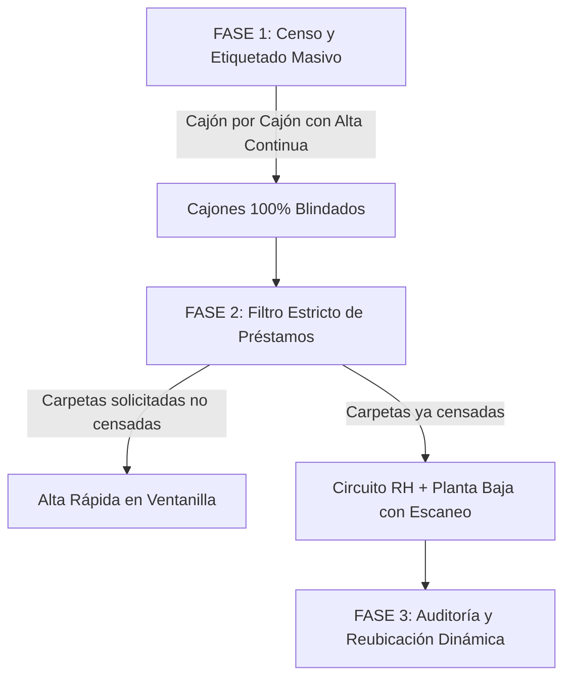

# MANUAL METODOLÓGICO DE IMPLEMENTACIÓN Y OPERACIÓN
## Sistema Integral de Gestión de Archivo — ISSSTE Baja California

---

## 1. INTRODUCCIÓN Y ENFOQUE ESTRATÉGICO

### 1.1 El Dilema Clave: ¿Ajustar el Archivo al Sistema o el Sistema al Archivo?
Uno de los errores más comunes en la digitalización de archivos físicos es intentar "ordenar y reclasificar todas las carpetas antes de registrarlas en el sistema". En la práctica institucional, ese enfoque colapsa la operación diaria, extravía expedientes en tránsito y agota al personal.

> **Principio Rector:**  
> **"No muevas el archivo para encajarlo en el software; registra el software para reflejar la realidad física de tus gavetas, y usa el software para gobernar el orden."**

El sistema ha sido diseñado con una arquitectura **flexible por gavetas y cajones (rangos alfabéticos y secciones especiales como Directivos)**. Por lo tanto, la metodología institucional recomendada es la **Adopción Progresiva (Bottom-Up)**, donde cada cajón censado y etiquetado queda inmediatamente blindado y controlado.

---

## 2. PREPARATIVOS PREVIOS (CHECKLIST TÉCNICO Y LOGÍSTICO)

Antes de iniciar la jornada de captura, asegúrate de contar con lo siguiente en la sala de archivo:

1. **Equipo de Cómputo / Estación de Trabajo:**
   - Navegador web moderno (Chrome, Edge, Firefox) conectado a la red local de la delegación.
2. **Impresora de Etiquetas:**
   - Impresora térmica calibrada para etiquetas autoadhesivas estándar de archivo.
   - Configurada en el sistema operativo para imprimir sin márgenes innecesarios.
3. **Lector de Código de Barras / QR:**
   - Lector USB tipo pistola o cámara de dispositivo móvil integrada (el sistema cuenta con escáner autónomo offline).
4. **Catálogo de Ubicaciones Inicial:**
   - En el menú **Sistema $\rightarrow$ Archiveros** (`/locations`), dar de alta las gavetas y cajones físicos tal cual están rotulados hoy en día en la oficina (ejemplo: Gaveta `G-01`, Cajones `1`, `2`, `3`, `4` con sus respectivos rangos `A - C`, `D - G`, etc.).

---

## 3. METODOLOGÍA DE IMPLEMENTACIÓN EN 3 FASES

---

## 4. FASE 1: CENSO Y ETIQUETADO MASIVO ("CAJÓN POR CAJÓN")

Esta fase permite avanzar sistemáticamente sin interrumpir el servicio de consulta.

### Paso 1: Selección del Cajón de Trabajo
1. El operador se sitúa frente a una gaveta física específica (ejemplo: **Gaveta G-01, Cajón 1**).
2. En el sistema, accede a: **Expedientes $\rightarrow$ Alta Continua (WIP)** (`/expedients/continuous-create`).
3. Selecciona:
   - **Gaveta / Archivero:** `G-01`
   - **Cajón / Rango:** `Cajón 1 — [ Rango: A - C ]`
4. El sistema activará la sesión y mostrará los contadores en tiempo real:
   - *Rango alfabético activo*
   - *Pendientes en cajón* (empleados de la plantilla sin expediente en ese rango)
   - *Ya con expediente*

### Paso 2: Flujo Carpeta en Mano $\rightarrow$ Generación de Etiqueta
1. El operador extrae la primera carpeta física del cajón.
2. En pantalla aparece automáticamente el empleado pendiente en orden alfabético estricto.
3. **Verificación rápida:** Corrobora que el nombre del empleado físico coincida con el visor (RFC, número de empleado o puesto).
4. Presiona el botón: **`Crear Expediente y Etiqueta`**.
5. El sistema:
   - Genera el código de barras institucional único (ejemplo: `EXP-00142-V1`).
   - Muestra la vista previa de la etiqueta lista para impresión.
6. Presiona **`Imprimir Etiqueta`** (o `Enter`), la etiquetadora expulsa la etiqueta.
7. El operador pega la etiqueta en la ceja visible / lomo de la carpeta y la devuelve a su posición física en el cajón.
8. Presiona **`Confirmar y Siguiente`**. La pantalla avanza inmediatamente al siguiente empleado.

### Paso 3: Manejo de Casos Especiales durante el Censo
- **Caso A: El empleado en pantalla no tiene carpeta física en ese lote:**
  - Si en el cajón no encuentras la carpeta física de ese empleado, presiona **`Aplazar (carpeta no está en este lote)`**.
  - El empleado no se borra ni se altera: pasa a la bandeja inferior de *Aplazados* para que la jornada continúe sin detenerse.
- **Caso B: La carpeta física encontrada está fuera de orden alfabético:**
  - Si aparece una carpeta que pertenece a otro cajón o letra, se aparta temporalmente en una bandeja de "Pendientes de Reubicación".
- **Caso C: La persona ya cuenta con expediente previamente registrado:**
  - El sistema detecta duplicados en milisegundos y muestra una alerta preventiva evitando dobles registros.

---

## 5. FASE 2: EL CIRCUITO DE PRÉSTAMOS (REGLA DE TOLERANCIA CERO)

Desde el primer día de uso del sistema, se debe establecer la política institucional:

> **"Ningún expediente físico sale de Recursos Humanos sin registro digital previo."**

### 5.1 Solicitud y Aprobación (Mesa de Control - RH)
1. El usuario solicitante o el encargado genera la petición desde **Préstamos $\rightarrow$ Solicitar Préstamo** (`/loans/request`).
2. El Encargado de Archivo revisa la solicitud en **Préstamos $\rightarrow$ Mesa de Control** (`/loans/manage`):
   - Puede aprobar o rechazar.
   - En estado *Aprobado*, el operador de archivo recibe la notificación para la extracción física.

### 5.2 Extracción y Despacho Físico (Planta Baja / Operador)
1. El operador ingresa a **Préstamos $\rightarrow$ Despacho** (`/loans/dispatch`).
2. Con la lista de extracción (o *Picking List*), localiza el expediente en la gaveta indicada.
3. **Escaneo de Salida:** Escanea el código de barras de la carpeta con la pistola o cámara móvil.
4. El estado cambia en tiempo real a **Extraído / En Espera de Entrega**.
5. Al momento de entregar físicamente la carpeta al solicitante:
   - El encargado registra la **Nota de Entrega** (ej. *"Se entrega con 120 fojas útiles, carátula en buen estado"*).
   - Se confirma la entrega: el préstamo pasa a estado **Prestado (Activo)** con conteo regresivo de vencimiento.

### 5.3 Retorno y Re-archivado
1. Cuando el solicitante devuelve el expediente:
   - El operador abre la pantalla de despacho y **escanea el código de barras**.
   - Se capturan las notas de recepción física (ej. *"Recibido completo y sin tachaduras"*).
2. El expediente pasa a **Devuelto (Por re-archivar)**.
3. El operador vuelve a colocar la carpeta en su gaveta y confirma el re-archivado. El expediente queda nuevamente **Disponible**.

---

## 6. FASE 3: AUDITORÍAS PERIÓDICAS Y REUBICACIÓN DINÁMICA

Conforme los expedientes circulan, no es necesario reordenar manualmente las carpetas en papel:

1. **Escáner Inteligente (`/expedients/scanner`):**
   - Si un expediente devuelto debe guardarse en una gaveta distinta por falta de espacio, el operador abre el Escáner Inteligente, escanea el código y selecciona la nueva gaveta/cajón.
   - El sistema actualiza el inventario físico instantáneamente y registra el movimiento en la bitácora de auditoría.
2. **Auditoría de Control (`/expedients/audit`):**
   - Periódicamente (ej. semanal o mensual), el supervisor abre un cajón, activa la auditoría y escanea consecutivamente todas las carpetas contenidas.
   - El sistema marcará en verde las carpetas correctas, alertará si falta alguna y avisará si hay una carpeta "infiltrada" que pertenece a otra gaveta.

---

## 7. ROLES Y RESPONSABILIDADES

| Rol | Pantallas Clave | Responsabilidad Primaria |
| :--- | :--- | :--- |
| **Administrador / Encargado de RH** | `Alta Continua`, `Mesa de Control`, `Archiveros`, `Usuarios` | Configurar gavetas, validar altas masivas, autorizar préstamos y supervisar reportes. |
| **Operador de Archivo (Planta Baja)** | `Despacho`, `Picking List`, `Escáner Inteligente`, `Auditoría` | Extraer carpetas, escanear códigos de salida/retorno, inspección física de fojas y re-archivado. |
| **Usuario Solicitante (Consultas)** | `Bandeja Personal`, `Solicitud de Préstamo` | Generar solicitudes de expedientes requeridos para trámites institucionales y dar seguimiento a sus devoluciones. |

---

## 8. PLAN DE ACCIÓN RECOMENDADO (PRIMERAS 2 SEMANAS)

- **Semana 1: Configuración y Prueba Piloto**
  - Día 1: Alta de Archiveros y Cajones actuales en `/locations`.
  - Día 2: Prueba piloto con la primera gaveta (Cajón 1) utilizando `Alta Continua`. Ajuste de impresión térmica.
  - Día 3-5: Capacitación al operador en escaneo de despacho y retorno con códigos de barras.
- **Semana 2: Cierre de Préstamos Informales**
  - Implementación obligatoria del módulo de Préstamos para todo expediente que salga del área.
  - Censo progresivo de los cajones restantes (meta de 1 a 2 cajones diarios por turno).

---
*Manual generado conforme a los estándares de desarrollo de la plataforma institucional ISSSTE Baja California (2026).*
